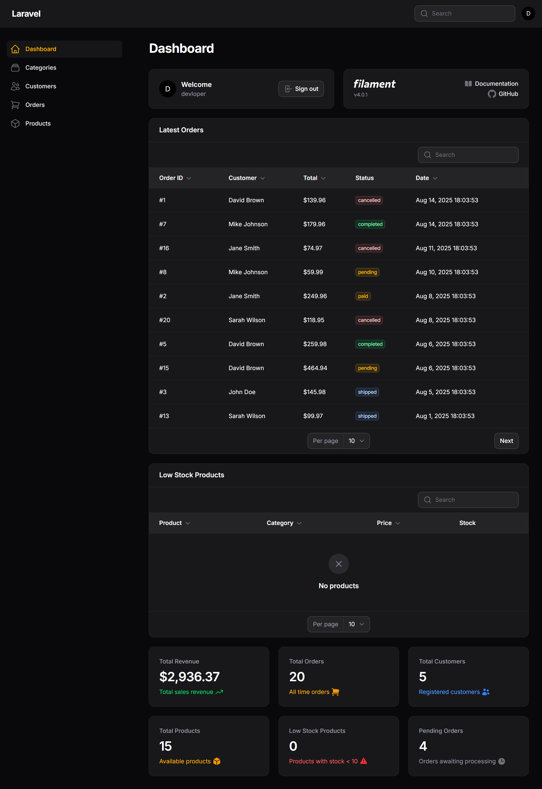

# 🛍️ Modern E-Commerce Platform | Laravel 12 + Filament + Vue 3 | Complete Admin & Customer Portal

> **A production-ready e-commerce solution featuring Laravel 12 backend, Filament admin panel, and Vue 3 frontend with complete order management, inventory tracking, and responsive design.**

[](https://laravel.com)
[](https://filamentphp.com)
[](https://vuejs.org)
[](https://tailwindcss.com)
[](https://php.net)
[](https://opensource.org/licenses/MIT)
[](https://github.com/palkeshpatel/ecommerce-website/actions)
[](https://github.com/palkeshpatel/ecommerce-website)
[](https://github.com/palkeshpatel/ecommerce-website)

## 📋 Table of Contents

-   [🚀 Live Demo](#-live-demo)
-   [✨ Key Features](#-key-features)
-   [🛠️ Tech Stack](#️-tech-stack)
-   [📸 Screenshots](#-screenshots)
-   [⚡ Quick Start](#-quick-start)
-   [📦 Installation](#-installation)
-   [🔧 Configuration](#-configuration)
-   [📊 Features Overview](#-features-overview)
-   [🏗️ Architecture](#️-architecture)
-   [🎯 Use Cases](#-use-cases)
-   [🤝 Contributing](#-contributing)
-   [📄 License](#-license)

## 🚀 Live Demo

-   **Customer Frontend**: [Demo Link](http://localhost:8000)
-   **Admin Panel**: [Admin Demo](http://localhost:8000/admin)
-   **GitHub Repository**: [https://github.com/palkeshpatel/ecommerce-website](https://github.com/palkeshpatel/ecommerce-website)

## ✨ Key Features

### 🎛️ **Admin Panel (Filament)**

-   📦 **Product Management**: Full CRUD with image upload and bulk operations
-   📂 **Category Management**: Hierarchical category organization
-   👥 **Customer Management**: Customer profiles and order history
-   📋 **Order Management**: Real-time status tracking (pending → paid → shipped → completed)
-   📊 **Analytics Dashboard**: Revenue charts, order trends, and inventory insights
-   ⚠️ **Low Stock Alerts**: Automated inventory monitoring
-   📈 **Sales Reports**: Detailed revenue and performance analytics

### 🛒 **Customer Frontend (Vue 3 + Inertia)**

-   🏠 **Modern Homepage**: Hero sections, featured products, category browsing
-   🔍 **Advanced Search**: Product search with filters and sorting
-   📱 **Responsive Design**: Mobile-first, tablet, and desktop optimized
-   🛍️ **Shopping Cart**: Persistent cart with quantity management
-   💳 **Secure Checkout**: Multi-step checkout with validation
-   📧 **Order Tracking**: Real-time order status updates
-   ⚡ **Performance**: Fast loading with lazy loading and caching

## 🛠️ Tech Stack

| Technology      | Version | Purpose             |
| --------------- | ------- | ------------------- |
| **Laravel**     | 12.x    | Backend Framework   |
| **Filament**    | 4.x     | Admin Panel         |
| **Vue.js**      | 3.x     | Frontend Framework  |
| **Inertia.js**  | Latest  | SPA-like Experience |
| **TailwindCSS** | 4.x     | Styling Framework   |
| **MySQL**       | 8.0+    | Database            |
| **PHP**         | 8.2+    | Server Language     |
| **Node.js**     | 18+     | Build Tool          |
| **Vite**        | Latest  | Asset Bundling      |

## 📸 Screenshots

### 🔐 Admin Login


*Secure admin login interface with modern dark theme design*

### 📊 Admin Dashboard



*Comprehensive admin dashboard featuring order management, product analytics, and real-time statistics*

### 🛒 Customer Frontend


*Modern customer-facing e-commerce interface (screenshot coming soon)*

## ⚡ Quick Start

```bash
# Clone the repository
git clone https://github.com/palkeshpatel/ecommerce-website.git
cd ecommerce-website

# Install dependencies
composer install
npm install

# Setup environment
cp .env.example .env
php artisan key:generate

# Configure database and run migrations
php artisan migrate --seed

# Create admin user
php artisan make:filament-user

# Build assets and start server
npm run build
php artisan serve
```

## 📦 Installation

### Prerequisites

-   **PHP** 8.2 or higher
-   **Composer** 2.0 or higher
-   **Node.js** 18 or higher
-   **MySQL** 8.0 or higher
-   **Git**

### Step-by-Step Installation

1. **Clone Repository**

    ```bash
    git clone https://github.com/palkeshpatel/ecommerce-website.git
    cd ecommerce-website
    ```

2. **Install PHP Dependencies**

    ```bash
    composer install --optimize-autoloader --no-dev
    ```

3. **Install Node.js Dependencies**

    ```bash
    npm install
    ```

4. **Environment Configuration**

    ```bash
    cp .env.example .env
    php artisan key:generate
    ```

5. **Database Setup**

    ```env
    DB_CONNECTION=mysql
    DB_HOST=127.0.0.1
    DB_PORT=3306
    DB_DATABASE=ecommerce_db
    DB_USERNAME=your_username
    DB_PASSWORD=your_password
    ```

6. **Run Migrations & Seeders**

    ```bash
    php artisan migrate --seed
    ```

7. **Create Admin User**

    ```bash
    php artisan make:filament-user
    ```

8. **Build Production Assets**

    ```bash
    npm run build
    ```

9. **Start Application**
    ```bash
    php artisan serve
    ```

## 🔧 Configuration

### Environment Variables

Key configuration options in `.env`:

```env
APP_NAME="E-Commerce Platform"
APP_ENV=production
APP_DEBUG=false

DB_CONNECTION=mysql
DB_HOST=127.0.0.1
DB_PORT=3306
DB_DATABASE=ecommerce_db
DB_USERNAME=your_username
DB_PASSWORD=your_password

MAIL_MAILER=smtp
MAIL_HOST=smtp.mailtrap.io
MAIL_PORT=2525
MAIL_USERNAME=null
MAIL_PASSWORD=null
MAIL_ENCRYPTION=null
MAIL_FROM_ADDRESS="hello@example.com"
MAIL_FROM_NAME="${APP_NAME}"
```

### File Permissions

```bash
chmod -R 755 storage bootstrap/cache
chown -R www-data:www-data storage bootstrap/cache
```

## 📊 Features Overview

| Feature                 | Description                                 | Status         |
| ----------------------- | ------------------------------------------- | -------------- |
| **Product Management**  | CRUD operations, image upload, bulk actions | ✅ Complete    |
| **Category Management** | Hierarchical categories with SEO slugs      | ✅ Complete    |
| **Order Processing**    | Multi-status order workflow                 | ✅ Complete    |
| **Customer Portal**     | Registration, profiles, order history       | ✅ Complete    |
| **Admin Dashboard**     | Analytics, reports, real-time stats         | ✅ Complete    |
| **Shopping Cart**       | Persistent cart with session management     | ✅ Complete    |
| **Search & Filtering**  | Advanced product search and filtering       | ✅ Complete    |
| **Responsive Design**   | Mobile-first responsive interface           | ✅ Complete    |
| **Payment Integration** | Ready for payment gateway integration       | 🔄 In Progress |
| **Email Notifications** | Order confirmations and updates             | 🔄 In Progress |

## 🏗️ Architecture

```
ecommerce-website/
├── app/
│   ├── Filament/Resources/     # Admin panel resources
│   │   ├── Products/          # Product management
│   │   ├── Categories/        # Category management
│   │   ├── Orders/           # Order management
│   │   └── Customers/        # Customer management
│   ├── Http/Controllers/      # Frontend controllers
│   ├── Models/               # Eloquent models
│   └── Providers/            # Service providers
├── database/
│   ├── migrations/           # Database schema
│   └── seeders/             # Sample data
├── resources/
│   └── js/
│       ├── Components/       # Vue 3 components
│       ├── Layouts/         # Page layouts
│       └── Pages/           # Inertia pages
└── routes/
    └── web.php              # Application routes
```

## 🎯 Use Cases

### For Developers

-   **Learning Laravel 12**: Modern Laravel development patterns
-   **Filament Admin**: Building admin panels with Filament
-   **Vue 3 + Inertia**: SPA-like applications without API complexity
-   **E-commerce Development**: Complete e-commerce solution reference

### For Businesses

-   **Startup MVP**: Quick e-commerce platform deployment
-   **Small Business**: Complete online store solution
-   **Agency Projects**: Customizable e-commerce foundation
-   **Educational**: Training and demonstration purposes

### For Enterprises

-   **Custom Development**: Extensible architecture for custom features
-   **Multi-vendor**: Foundation for marketplace development
-   **B2B/B2C**: Adaptable for different business models

## 🚀 Performance Optimizations

-   **Laravel Caching**: Route, config, and query caching
-   **Asset Optimization**: Vite bundling with code splitting
-   **Database Indexing**: Optimized database queries
-   **Image Optimization**: Automatic image compression
-   **CDN Ready**: Static asset delivery optimization

## 🔒 Security Features

-   **Laravel Security**: Built-in CSRF, XSS, and SQL injection protection
-   **Authentication**: Secure user authentication and authorization
-   **Input Validation**: Comprehensive form validation
-   **File Upload Security**: Secure file upload handling
-   **HTTPS Ready**: SSL/TLS configuration support

## 📈 SEO Features

-   **Meta Tags**: Dynamic meta title and description
-   **Structured Data**: JSON-LD schema markup
-   **Clean URLs**: SEO-friendly URL structure
-   **Sitemap Generation**: Automatic XML sitemap
-   **Open Graph**: Social media sharing optimization

## 🤝 Contributing

We welcome contributions! Please follow these steps:

1. **Fork** the repository
2. **Create** a feature branch (`git checkout -b feature/amazing-feature`)
3. **Commit** your changes (`git commit -m 'Add amazing feature'`)
4. **Push** to the branch (`git push origin feature/amazing-feature`)
5. **Open** a Pull Request

### Development Guidelines

-   Follow PSR-12 coding standards
-   Write meaningful commit messages
-   Add tests for new features
-   Update documentation as needed
-   Ensure responsive design compatibility

## 📄 License

This project is licensed under the MIT License - see the [LICENSE](LICENSE) file for details.

## 🆘 Support & Community

### Documentation

-   [Laravel Documentation](https://laravel.com/docs)
-   [Filament Documentation](https://filamentphp.com/docs)
-   [Vue.js Documentation](https://vuejs.org/guide/)

### Community

-   [GitHub Issues](https://github.com/palkeshpatel/ecommerce-website/issues)
-   [GitHub Discussions](https://github.com/palkeshpatel/ecommerce-website/discussions)
-   [Laravel Community](https://laravel.com/community)

### Professional Support

For professional support and custom development:

-   **Email**: [patel.palkesh@gmail.com](mailto:patel.palkesh@gmail.com)
-   **Portfolio**: [https://palkeshpatel.github.io/my-portfolio/](https://palkeshpatel.github.io/my-portfolio/)
-   **LinkedIn**: [https://www.linkedin.com/in/palkesh-patel-429b3b55/](https://www.linkedin.com/in/palkesh-patel-429b3b55/)

## 🌟 Star History

[](https://star-history.com/#palkeshpatel/ecommerce-website&Date)

## 📊 Repository Stats


---

## 🎉 Showcase

This project demonstrates:

-   ✅ **Modern Laravel Development**: Latest Laravel 12 features and best practices
-   ✅ **Filament Admin Panel**: Professional admin interface with advanced features
-   ✅ **Vue 3 + Inertia.js**: Modern frontend architecture without API complexity
-   ✅ **Complete E-commerce**: Full-featured online store solution
-   ✅ **Production Ready**: Optimized for deployment and scaling
-   ✅ **Developer Friendly**: Clean code, comprehensive documentation, and extensible architecture

**Built with ❤️ by [Palkesh Patel](https://palkeshpatel.github.io/my-portfolio/) - Full Stack Laravel + Vue.js Developer**

*9+ years of experience in web development, specializing in Laravel, Vue.js, and modern e-commerce solutions.*

---

<div align="center">

**If this project helps you, please give it a ⭐️ star on GitHub!**

[](https://github.com/palkeshpatel/ecommerce-website/stargazers)
[](https://github.com/palkeshpatel/ecommerce-website/network)
[](https://github.com/palkeshpatel/ecommerce-website/issues)
[](https://github.com/palkeshpatel/ecommerce-website/blob/main/LICENSE)

</div>
